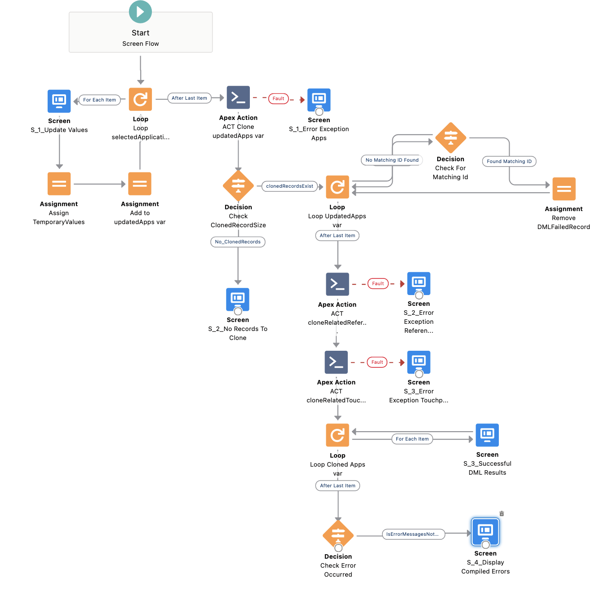

# Clone Multiple Records with Related records from the Listview

__Scenario A__: Create a custom action to clone multiple records from the listview including related records. A staff member needs to update external id and neccessary fields for each record at the time of the cloning action.

__Builind Blocks :__ Rest API, JSON, InvocableMethod, ScreenFlow, Custom Quick Acition Button 

__Summary:__  Your company offers a certification program requiring an application, references and review/training processes hosted in a proprietary software. The certification lasts a year and applicants are required to maintain their certifications by submitting the renewal request to the app. When a returning applicant submits the interest to return, the app creates an a renewal application by cloning the previously existing application with related supplements to start the new review process. This workflow eliminates the full reviewing process for the returning applicants.

Salesforce REST API/JSON integration of the external data comes in when there is a new application record; however, the cloned application of the returning applicant should be cloned manually from Salesforce due to irregularity of each applicant's experience after the first program. 

You, as a Salesforce guru, provide solutions for the staff member to clone multiple records from the application listview including related records and to add new info on the renewed application.

## Screenflow Overview
.

## How to Modify Dynamic Apex
1. [ListviewCloneMultipleController.cls](force-app/main/default/classes/ListviewCloneMultipleController.cls) 

This class contains controller logic for any standard or custom objects of your choice. The apex is dynamically written except for the getter and setter datatype for the variable named __ListSelectedRecords__. This variable is being referenced by a visualforce and the datatype should be specified to match with the StandardController.
    
    
    // the example sets Application__c custom object as a parent
    public List<Application__c> ListSelectedRecords { 
       get;	
       set;
    }

The incovable method for processing a parent record also being expressed in the class. The method requires inputs from a user on the newer record data which is different from the original record. For example, `new external id` or `new employer` info.

2. [CloneMultipleRelatedRecordInvocable.cls](force-app/main/default/classes/CloneMultipleRelatedRecordsInvocable.cls) 

This class contains one invocable method which processes the cloning of child object records when the cloning of parent object is being initiated. The method does not require a uer input though it can be easily configured by adding new variables to FlowInputParameters inner class.
## How to Modify Visualforce StandardController

## How to Modify ScreenFlow

1. [ListviewCloneMultipleController](force-app/main/default/classes/ListviewCloneMultipleController.cls) 

## Solution to these Issues
1. [Salesforce Idea: Clone API Call](https://trailblazer.salesforce.com/ideaView?id=08730000000BqWV)
2. [Clone Opportunity through Salesforce REST API](https://salesforce.stackexchange.com/questions/321327/clone-opportunity-through-salesforce-rest-api)
## Credit
